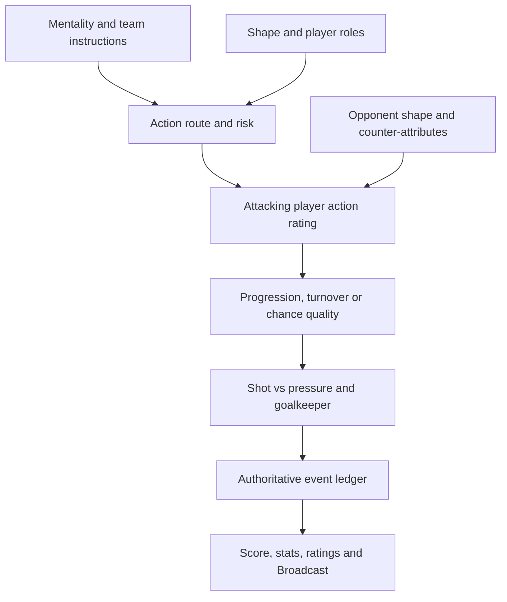

# Pitch — Attribute-to-Tactics Causality 2.0

**Status:** Active implementation plan — T0 baseline and calibration is implemented in this change; T1 follows after merge

**Repository baseline:** `howellsryan/pitch` `main` at `00b92cf34f9385933fa5b3f8eeca0b76cf2229ef`, after PR #27

**Prepared:** 4 September 2026

**Product constraint:** Pitch remains a simulator-only game. Broadcast presents the authoritative simulation; it is not a second match engine and does not add manual football controls.

## 1. Executive recommendation

Make this a dedicated **Attribute-to-Tactics Causality 2.0** workstream and prioritise it before adding more tactical UI or more career difficulty controls.

The central rule should be:

> **Tactics decide what the team tries, roles decide who attempts it, attributes decide how well it is executed, and the opposition decides how difficult it is.**

Pitch should not solve this by adding more unconditional tactic multipliers such as “Direct = +5% goals” or “Attacking = +20% finishing.” That would make the labels appear meaningful while players remain interchangeable.

Instead:

1. Retain Pace, Shooting, Passing, Dribbling, Defending and Physical as first-class player attributes.
2. Resolve each attacking phase through a small number of football actions: circulate, progress, carry, play into space, cross, duel, create and shoot.
3. Make tactical instructions change the **frequency, location and risk** of those actions.
4. Make attributes and roles determine their **success**.
5. Resolve every action against the opponent’s players, shape and instructions.
6. Generate score, shots, xG, possession, corners and Broadcast moments from the same authoritative action ledger.

This gives Pitch the important part of Football Manager’s approach without copying its full complexity: a fast player becomes more valuable when space is attacked; a dribbler becomes more valuable when asked to carry; a good shooter converts more of the chances that reach them; and every upside has a football-shaped counter.

## 2. What the repository does today

### 2.1 Strong foundations already exist

- `src/modules/tactics.js` owns one shared schema with nine team instructions, position-compatible roles, AI archetypes and bounded tactical trade-offs.
- `src/modules/matchEngine.js` is the single authoritative outcome engine.
- Quick Sim and segmented Broadcast share seeded, serialisable RNG and are covered by parity tests.
- Roles, tactics, Manager DNA, recruitment fit and opponent insight already share common domain functions.
- Fitness, form, morale, sharpness, rehabilitation, traits and positional familiarity already feed the effective-player model.

Those boundaries should be extended, not replaced.

### 2.2 The missing link

PR #27 now retrieves FC 27 Pace, Shooting, Passing, Dribbling, Defending and Physical values. However:

- `tools/lib/playerRefresh.mjs` passes those six values into `aggregatesFromEa()`;
- the pipeline converts them into `attack`, `midfield` and `defence`;
- the generated CSV and runtime player objects retain only those three aggregates plus `goalkeeping`;
- `roleSuitability()` therefore evaluates roles using only Attack/Midfield/Defence/Goalkeeping;
- the match engine selects possession from midfield strength, then can roll directly for a goal from Attack versus Defence/Goalkeeping;
- scorer and assister selection use Attack and Midfield respectively;
- most match statistics are synthesised after the result rather than accumulated from the events that produced it.

Therefore two forwards with the same Attack rating but very different Pace, Shooting and Dribbling are currently almost equivalent in the simulation. A fast forward does not specifically exploit a high line, and a strong shooter does not specifically improve conversion.

### 2.3 Current tactics are meaningful, but squad-independent

The current instruction system already models sensible generic trade-offs. For example, direct counter-attacks receive an advantage against a high line, while pressing consumes more fitness and creates more cards.

The remaining problem is that the advantage is broadly the same whichever suitable players are selected. The next version must change this from:

`instruction vs instruction -> team-wide multiplier`

to:

`instruction -> attempted action -> relevant players and roles -> attributes vs opposition -> outcome`

## 3. Target causal model



Each match phase should answer six questions:

1. **Who has the ball?** Team control, midfield presence and the current state of the match decide possession.
2. **What does the team try?** Instructions, mentality, zone, roles and score state choose the route.
3. **Who performs it?** Shape and roles choose the passer, carrier, runner, target and defenders.
4. **Can they execute it?** Relevant effective attributes resolve against the opponent’s relevant attributes.
5. **What did it produce?** Retention, territory, turnover, set piece, low-quality chance or high-quality chance.
6. **Does the chance become a goal?** Shooting and chance quality resolve against defensive pressure and goalkeeping.

The instruction should affect the first half of that chain; it must not directly make the final shot more accurate.

## 4. Player attribute model

### 4.1 Introduce one versioned detailed profile

Add a versioned player-owned profile:

```js
attributeProfile: {
  version: 1,
  pace: 84,
  shooting: 76,
  passing: 79,
  dribbling: 85,
  defending: 42,
  physical: 71
}
```

Recommended ownership rules:

- `playerModel.js` remains the canonical owner of player ability, normalization and effective-attribute selectors.
- The detailed profile is the source for action execution.
- Existing `attack`, `midfield`, `defence` and `goalkeeping` remain as headline/compatibility aggregates during the transition. Existing overall ratings and selection/valuation behaviour must not jump during migration.
- No second persisted “effective overall” is introduced. Form, fitness, morale, sharpness, rehabilitation, traits and positional suitability remain transient modifiers selected through the existing player-model boundary.
- All development changes go through one helper that updates the detailed profile and then refreshes its derived aggregates. This prevents detailed attributes and headline ratings drifting apart.
- Goalkeepers initially retain the current `goalkeeping` rating. A later, separately sourced extension may split it into shot-stopping, handling, positioning, distribution and sweeping; invented goalkeeper detail should not block this work.

### 4.2 Preserve the six attributes already entering the refresh pipeline

Update the data path end to end:

1. `attrsFromEa()` continues to read the six face attributes.
2. Player CSVs gain six explicit columns.
3. `tools/csv-to-league.mjs` and `tools/lib/generate.mjs` carry them into generated runtime data.
4. New-career player rows persist the detailed profile.
5. Validation fails if a non-goalkeeper from the authoritative refresh is missing any detailed attribute.
6. The audit report records detailed-attribute coverage and distribution by league and position.

Do not couple the match engine to an external-provider response shape. The import adapter translates external data into Pitch’s domain profile, and the engine consumes only the Pitch schema.

### 4.3 Safe migration for existing careers

Increment the player-model version and run a one-time, idempotent migration over every player location already covered by P3/P9:

- normal player rows;
- free agents;
- academy/youth players;
- loaned players;
- any legacy `team.youthPlayers` or save-contained cohort rows still supported by migration.

Backfill priority:

1. **Stable ID match to current seed data:** copy the detailed shape, then rescale it around the saved player’s current headline ability so career development is preserved.
2. **No seed match:** create a deterministic position/archetype profile from the player’s existing aggregates, position, age, role and traits.
3. **Generated youth/newgens:** generate a correlated detailed profile at creation time, bounded by current ability and potential.

Migration invariants:

- the player’s pre-migration headline rating is unchanged;
- potential, development progress, form, fitness, morale, sharpness, injury state, history, club and contract are unchanged;
- the same save produces the same backfill on retry;
- the version gate prevents a full-world scan on every load;
- an already-started live match finishes under its original simulation version; migration becomes active at the next safe fixture boundary.

### 4.4 Development, training and age curves

Development must become attribute-specific rather than increasing only Attack/Midfield/Defence:

| Existing plan | Detailed development bias |
|---|---|
| Finishing | Shooting first; smaller Physical/Dribbling support depending on role |
| Creation | Passing and Dribbling |
| Defending | Defending, then Physical/Pace depending on position |
| Physical | Pace and Physical, with age-dependent limits |
| Role training | The configured role’s weighted attributes |
| Position conversion | Target-position profile plus familiarity |
| Balanced | Weighted spread appropriate to position and current weaknesses |

Decline should also become attribute-specific. Pace should generally peak and decline earlier than Passing or Defending; Physical should respond to age and workload; technical attributes should not all decline simultaneously. Potential remains a ceiling on total durable ability, not six independent routes to exceed the same ceiling.

## 5. Attribute-to-action mapping

The following are **initial relative weights for implementation and paired-seed calibration**, not final balance constants. Attributes that do not describe an action should not be included merely to use all six.

| Football action | Attacking execution | Defensive counter | Produces |
|---|---|---|---|
| Short circulation under pressure | Passing 60%, Dribbling 25%, Physical 15% | Pressing players: Defending 45%, Physical 35%, Pace 20% | Retention, control, or dangerous turnover |
| Vertical/direct pass | Passer Passing 60%; receiver Pace 25%, Physical 15% | Defending 50%, recovery Pace 35%, Physical 15% | Territory, lost ball, or advanced receipt |
| Through ball / pass into space | Passer Passing 55%; runner Pace 35%, role movement 10% | Defending 50%, Pace 40%, Physical 10% | Breakaway or intercepted pass |
| Ball carry / one-on-one | Dribbling 60%, Pace 25%, Physical 15% | Defending 60%, Physical 25%, Pace 15% | Progression, foul, or turnover |
| Wide delivery | Deliverer Passing 55%, Dribbling 25%, Pace 20% | Wide defender Defending 60%, Pace 25%, Physical 15% | Block, corner, cross or cutback |
| Aerial/target duel | Physical 55%, Shooting 25%, Pace 5%, role 15% | Defending 50%, Physical 40%, Goalkeeping 10% | Knockdown, header, clearance or foul |
| Shot | Shooting 85%, Physical 15% under contact | Chance pressure from Defending plus Goalkeeping | Miss, block, save or goal |
| High press | Defending 45%, Physical 35%, Pace 20% | Passing 50%, Dribbling 35%, Physical 15% | Forced long ball, turnover, foul or bypass |
| Interception/tackle | Defending 65%, Pace 15%, Physical 20% | Passing/Dribbling/Pace according to route | Regain, failed challenge or foul |
| Recovery behind a high line | Pace 45%, Defending 40%, Physical 15% | Runner Pace 50%, Dribbling 25%, Physical 25% | Recovery, one-on-one or foul |
| Attacking set piece | Delivery from Passing; target Physical and Shooting | Defending, Physical and Goalkeeping | Clearance, second ball, shot or goal |

Use a bounded contest function rather than treating ratings as percentages:

```text
action quality = weighted effective attributes × positional familiarity × current-state modifier
contest edge   = action quality − opponent counter quality + bounded tactical/space context
success chance = calibrated sigmoid(contest edge)
```

Role suitability is an explanation derived from the same action weights, so it must not then be multiplied into action quality and count those attributes twice. Roles primarily change positioning, actor selection and action frequency; only independent familiarity or coordination effects may modify execution.

This gives diminishing returns at the extremes and prevents a 90 attribute from meaning “90% success.”

## 6. How each core attribute should matter tactically

| Attribute | Becomes especially valuable with | Becomes less valuable or is countered by | Main consequence |
|---|---|---|---|
| **Pace** | Pass Into Space, Counter, fast tempo, winger/inside-forward/poacher runs, overlaps, high-line recovery | Low block, compact space, fast cover defenders, sweeper keeper | More separation and recovery; it does not directly improve finishing |
| **Shooting** | Shoot on Sight, high-volume attacks, poacher/inside-forward roles, cutbacks and high-quality chances | Strong goalkeeper, blocks, poor chance quality, defensive pressure | Higher conversion and shot-on-target rate; it does not create possession by itself |
| **Passing** | Patient build-up, work into box, direct balls, switches, early delivery, play through press | Aggressive press, blocked lanes, high-risk tempo, poor receiving movement | Better retention, progression and chance creation; direct passes still carry higher turnover risk |
| **Dribbling** | Run at Defence, expressive play, wide isolation, central carries, counters, resisting a press | Strong tackling, double teams, compact space, fatigue | More successful carries and fouls won, but more turnovers when overused |
| **Defending** | High/front-foot press, compact block, interceptions, tackling, rest defence, protecting a lead | Technical overloads, strong dribblers, being dragged out of shape | More regains, blocks and suppression of chance quality |
| **Physical** | Aggressive press, high tempo, target-forward play, aerial crossing, duels, set pieces, repeated overlaps | Fatigue, congestion, technically superior opponents who evade contact | Duel strength, press sustainability and late-match resilience |
| **Goalkeeping** | Deep blocks that concede shots, one-on-ones, set pieces; later distribution/sweeping roles | High-quality close-range chances and rebounds | Saves and suppression of goals after a chance exists |

Important correction to the example “Dribbling is better with being direct”: vertical/direct football and dribbling can combine, but they are not the same instruction. Existing **Direct build-up** should favour forward passing, runners and target play. Add a separate **Run at Defence** instruction so a manager can deliberately favour carries. A direct team with weak passers but elite dribblers can then choose vertical carries; a direct team with a great passer and fast runners can choose balls into space.

## 7. Existing tactic behaviour after the change

| Existing instruction | Attribute-aware behaviour | Explicit trade-off/counter |
|---|---|---|
| Patient build-up | More short combinations; Passing/Dribbling resist pressure | Slower progression lets compact opponents settle; errors near goal are dangerous |
| Direct build-up | More vertical passes, target duels and early territory; Passing, Pace and Physical matter by route | Lower retention; low blocks remove space; inaccurate passers concede possession |
| Slow tempo | More decision time and retention; reduces Physical cost | Fewer transition opportunities and lets the defence organise |
| Fast tempo | More actions before the defence sets; Passing/Dribbling/Pace exploit disorder | Low technical/Physical quality creates mistakes and late fatigue |
| High defensive line | More territory and pressing support; Defending/Pace and sweeper-keeper ability protect space | Vulnerable to good Passing plus fast runners into space |
| Aggressive press | Defending/Pace/Physical determine turnover quality and sustainability | Can be passed/dribbled through; more fatigue, cards and late gaps |
| Wide attack | More winger/full-back carries and deliveries; Pace/Dribbling/Passing matter | Central rest defence weakens and counters can attack vacated channels |
| Narrow attack/block | More central combinations and compact defending | Wide switches, overlaps and deliveries create overloads |
| Counter | More immediate vertical passes and carries; Pace and Passing become decisive | Less control; low block/hold-shape opposition removes transition space |
| Work ball | Passing/Dribbling increase patience and shot quality | Fewer shots; compact elite defenders can deny the final opening |
| Early delivery | Passing supplies early balls to Physical/Shooting targets | Higher volume but lower average chance quality and more turnovers |
| Front-foot defending | Defending/Pace support stepping out and interceptions | Failed challenges expose space and increase fouls/cards |
| Compact defending | Defending/Physical protect central zones and shot quality | Concedes width, switches and crossing territory |
| Attack set pieces | Passing delivery plus Physical/Shooting targets increase threat | More players ahead of the ball increases counter exposure |

## 8. New and revised tactical controls

The first release should deepen decisions without turning the mobile tactics screen into a cockpit. Group controls by phase and reveal advanced options progressively.

### 8.1 Priority-one controls

| Phase | Control | Values | Why it is needed |
|---|---|---|---|
| In possession | **Use of space** | To Feet / Mixed / Pass Into Space | Creates the explicit Passing + runner Pace versus defensive line/recovery matchup |
| In possession | **Ball carrying** | Dribble Less / Balanced / Run at Defence | Gives Dribbling its own tactical purpose instead of hiding it inside Direct |
| In possession | **Shot selection** | Work Into Box / Balanced / Shoot on Sight | Lets Shooting quality alter whether shot volume or shot quality is preferable |
| Transition after loss | **Defensive transition** | Regroup / Balanced / Counter-press | Connects Defending, Physical and Pace to winning the ball back versus protecting shape |
| Out of possession | **Line of engagement** | Low / Mid / High | Separates where the press begins from where the defensive line sits |
| Shape | **Attacking width / defensive width** | Narrow / Balanced / Wide for each | The current single Width cannot express a wide attack and compact defensive block |

### 8.2 Priority-two controls

| Control | Values | Attribute/role purpose |
|---|---|---|
| Delivery type | Low/Cutback / Mixed / Aerial | Low balls favour Pace/Dribbling/Shooting; aerial balls favour Passing, Physical and aerial roles |
| Focus of play | Left / Centre / Right / Mixed | Routes actions through selected strengths, but makes the team more predictable |
| Creative freedom | Disciplined / Balanced / Expressive | Changes risky-pass/carry frequency; high Passing/Dribbling benefits, turnovers rise |
| Tackling approach | Stay on Feet / Balanced / Dive In | Defending controls timing; Physical affects duels; aggression raises regains and cards |
| Goalkeeper distribution | Short / Mixed / Long | Later supports goalkeeper distribution and target/counter routes without changing shot-stopping |
| Match management | Keep Playing / Balanced / Slow Game | Contextual late-match control affecting tempo, risk and time, not a pre-match goal modifier |

### 8.3 Later high-depth extension

After the action model is proven, introduce separate **In Possession** and **Out of Possession** shapes. FM26’s useful lesson is that a team may attack in a 4-3-3 and defend in a 4-1-4-1; roles then explain how each player moves between the two.

For Pitch this should be a later schema version, because dual shapes are cosmetic until the engine understands zones, rest defence, roles and transition distance. When added:

- constrain each player to one identity across both shapes;
- calculate transition effort and positional familiarity;
- warn about uncovered zones and unrealistic movement rather than silently blocking creative setups;
- make recruitment and training aware of both roles;
- show a simple mobile Combined view rather than reproducing Football Manager’s full interface.

Other later candidates are opposition instructions, set-piece takers/targets, overlap/underlap by flank and pressing traps. They should use the same action vocabulary rather than add standalone multipliers.

## 9. Tactics schema v2 and migration

Do not keep stretching the historical P2 schema without versioning it.

Recommended v1-to-v2 mapping:

| Tactics v1 | Tactics v2 migration |
|---|---|
| `buildUp` | Preserve as build-up directness |
| `tempo` | Preserve |
| `defensiveLine` | Preserve |
| `pressing` | Preserve as intensity |
| `width` | Copy to both `attackingWidth` and `defensiveWidth` |
| `transition` | Rename/alias to `onWin` |
| `chanceCreation: work_ball` | `shotSelection: work_into_box`; other new controls balanced |
| `chanceCreation: early_delivery` | `deliveryTiming: early`; `shotSelection: balanced` |
| `chanceCreation: balanced` | Balanced defaults |
| `defensiveApproach` | Preserve |
| `setPieces` | Preserve as commitment |

Rules:

- increment the tactics plan version;
- add a dedicated, idempotent save migration rather than changing the historical `buildP2SaveBackfill()` contract in place;
- preserve every existing explicit choice;
- balanced defaults must reproduce the closest possible current behaviour before the new causal model is enabled;
- Manager DNA gains the new dimensions but keeps old histories readable;
- exports, imports and cloud saves preserve the new version;
- all consumers continue to use the same normalized schema.

### Mentality should become a risk policy, not a finishing boost

Today mentality applies large direct multipliers to goal probability, resistance and shot totals. In the new engine:

- Attacking mentality commits more players, accepts riskier routes and lowers shot thresholds;
- Defensive mentality commits fewer players, protects rest defence and favours retention/clearance;
- Possession mentality favours support angles, circulation and counter-press structure;
- Balanced makes no strong route choice.

Mentality may change **volume, commitment and risk**, but it should not make an identical shot from an identical player intrinsically more likely to go in.

## 10. Roles: frequency first, suitability second

Roles should decide what a player is likely to do and where they participate. Their detailed attributes then decide whether they do it well.

| Existing role family | Main actions | Suggested key attributes |
|---|---|---|
| Poacher | Runs behind, occupies finishing zones, shoots | Shooting, Pace, then Physical |
| Target forward | Receives direct balls, contests aerials, lays off | Physical, Shooting, Passing |
| False nine | Drops, combines, carries and creates | Passing, Dribbling, Shooting |
| Complete forward | Mixed forward routes | Balanced Shooting/Pace/Passing/Dribbling/Physical |
| Winger | Isolated carries, byline runs, deliveries | Pace, Dribbling, Passing |
| Inside forward | Carries inside, runs behind, shoots | Dribbling, Pace, Shooting |
| Wide creator | Receives wide, switches and creates | Passing, Dribbling, then Pace |
| Advanced playmaker | Receives between lines, through balls, carries | Passing, Dribbling, Shooting |
| Deep playmaker | Circulation, switches, vertical passes | Passing, Dribbling, Defending |
| Box-to-box | Supports both boxes, presses, late arrivals | Physical, Passing, Defending, Dribbling/Shooting |
| Ball winner | Presses, tackles, protects transitions | Defending, Physical, Pace |
| Anchor | Screens space, intercepts, recycles | Defending, Physical, Passing |
| Overlapping full-back | Repeated wide runs, carries and crosses | Pace, Dribbling, Passing, Physical |
| Inverted full-back | Steps inside, circulates, protects transitions | Passing, Dribbling, Defending, Physical |
| Ball-playing centre-back | Builds and breaks lines | Defending, Passing, Physical |
| Stopper | Steps out, tackles and duels | Defending, Physical, Pace |
| Cover defender | Protects space behind | Pace, Defending, Physical |
| Sweeper keeper | Claims/sweeps behind a high line, distributes | Goalkeeping first; later Pace/Passing or GK-specific detail |

Replace the current role fit’s aggregate-only weights with detailed action weights. Keep position compatibility and familiarity as separate constraints. A player can be positionally natural but tactically unsuitable, or tactically gifted but unfamiliar with the slot; the UI should explain both.

Traits should alter tendencies or narrowly relevant actions rather than add a broad Attack/Midfield/Defence bonus. For example, Finisher affects shot execution, Wide Runner affects run frequency, Creator affects risky-pass selection, and Aerial Presence affects aerial duels.

## 11. Three concrete examples

### 11.1 Fast striker against a high line

Manager selects Direct, Counter and Pass Into Space. The engine increases through-ball route frequency. A capable passer must first execute the ball; the striker’s Pace is then tested against the covering defenders’ Pace and Defending. A high line creates more exploitable depth. If the same opponent drops into a low block, the space modifier disappears and the striker’s Pace offers much less value.

Result: Pace creates more and better breakaway chances in the right context, not a permanent goal bonus.

### 11.2 Elite dribbler asked to be direct

Manager selects Run at Defence, Fast tempo and attacks the dribbler’s flank. The role selection routes more possessions through that player and raises carry frequency. Dribbling/Pace/Physical contest the full-back’s Defending/Pace/Physical. Success creates territory, fouls and cutbacks; failure creates turnovers and counter-attacks. Direct build-up alone does not force dribbles—the carrying instruction does.

Result: the player’s individuality is visible, with an explicit risk for overusing the strength.

### 11.3 Great shooter in a low-creation side

Shooting affects shot accuracy and conversion once a chance reaches the player. Shoot on Sight generates more low-xG attempts; Work Into Box generates fewer, better chances. An elite shooter may make the higher-volume choice viable, while an average shooter benefits more from patience. Neither option fixes a side that cannot progress the ball or create chances.

Result: Shooting scores more goals over a sample, but it cannot bypass the rest of football.

## 12. Match-engine implementation shape

### 12.1 Add one pure action resolver under the authoritative engine

Keep `matchEngine.js` as the orchestrator. Add a pure, DOM/DB-free action-resolution module consumed only by the authoritative engine. It should own:

- route definitions and weights;
- actor selection from roles/positions;
- effective action ratings;
- defender/counter selection;
- contest probabilities;
- chance-quality buckets;
- typed action outcomes.

It must not simulate a separate score or be called independently by Broadcast.

### 12.2 Use a fixed RNG packet per phase

Allocate a fixed set of seeded random values for every phase—possession, route, actors, execution, defence, chance, shot, discipline and injury—even if some values are unused.

Benefits:

- whole-match and segmented-Broadcast parity remains straightforward;
- changing one attribute does not shift every later random draw;
- paired-seed tests can compare one tactical/attribute change fairly;
- replays and debugging can explain which stage changed the outcome.

The serialised live state retains the RNG cursor, tactic version and engine version.

### 12.3 Record a compact authoritative action ledger

An action record should contain stable identifiers and compact football context, for example:

```js
{
  phase: 44,
  minute: 33,
  teamId: 'liverpool',
  route: 'pass_into_space',
  actorId: 'passer-id',
  targetId: 'runner-id',
  defenderId: 'cover-id',
  outcome: 'high_quality_chance',
  shotId: 'shooter-id',
  xg: 0.31,
  finish: 'saved'
}
```

The stored season history should remain compact. Full action detail can live only during the active/recent match; persistent history stores aggregates and notable events, consistent with the existing bounded-ledger rules.

### 12.4 Derive statistics from actions

- possession from retained/control phases;
- shots and shots on target from actual shot outcomes;
- xG from actual chance-quality/context records;
- corners from blocked/deflected wide and shot actions;
- fouls/cards from failed challenges and tactical risk;
- goals/scorers/assists from the shot chain;
- player ratings from meaningful contributions and errors, not position-only random output.

This removes contradictions where the displayed stats do not describe the match that was simulated.

## 13. AI, recruitment, scouting and training integration

### AI managers

The current deterministic archetype remains a manager’s preferred identity, but lineup and squad attributes should affect feasibility:

- prefer Pass Into Space only when passers/runners can execute it;
- avoid an extreme high line with slow cover defenders unless the manager identity deliberately accepts the risk;
- choose target play when Physical/Passing profiles support it;
- make bounded opponent adaptations rather than re-optimising perfectly every fixture;
- make in-match changes through the same public tactic commands available to the user.

Manager DNA should record actual route/risk choices and outcomes. A manager can retain an identity while adapting, rather than being assigned an arbitrary club hash forever.

### Recruitment and loans

`roleSuitability()` already feeds transfer and loan logic. Once it becomes detailed and action-based:

- AI squad needs can request “fast cover defender,” “press-resistant midfielder,” or “runner for Pass Into Space,” not just a position and overall;
- managed recruitment recommendations can explain which tactical weakness a player solves;
- loan tactical fit uses the receiving club’s real action profile;
- overall quality remains important, preventing cheap specialists from becoming universally optimal.

### Scouting

Detailed attributes must respect the P5 uncertainty model:

- unscouted players show ranges or coarse values;
- role/tactic fit uses only known information in manager-facing views;
- the authoritative AI simulation may use the true profile, while the user’s recommendation surface must not leak it;
- a full report reveals the attributes needed for the target role and plan.

### Training

Training recommendations should connect directly to tactic fit: “Passing limits patient build-up,” “Pace makes High Line risky,” or “Dribbling suits Run at Defence.” Do not turn tactical fit into a second automatic growth bonus; training changes the player, and the changed player then executes the tactic better.

## 14. Explainability and UI

### Tactics screen

For each instruction, show three small pieces of information:

- **What it changes:** “More runs and passes behind the line.”
- **Who it relies on:** “Passers: Passing; runners: Pace.”
- **Current XI fit:** Strong / Good / Mixed / Poor, with at most two reasons.

Example:

> **Pass Into Space — Strong fit** — Fast front three; two strong progressive passers. Risk: less effective against a deep block.

Avoid one opaque “Tactic Rating 87.” Show strengths and risks by phase so the manager still makes the decision.

### Player/role view

- highlight the attributes used by the selected role;
- separate **position familiarity** from **role fit**;
- show the action tendencies the role changes;
- show conflicting instructions, such as a Target Forward in a low-cutback system;
- keep exact values subject to scouting knowledge outside the managed squad.

### Pre-match insight

Use real opponent profile and likely lineup to surface actionable, uncertain observations:

- “Their centre-backs lack recovery Pace; Pass Into Space may threaten a high line.”
- “Their narrow block is strong centrally but concedes wide delivery.”
- “Their press is intense; your selected midfield is vulnerable under pressure.”

### Post-match analysis

Report a few causal facts from the action ledger:

- route attempts and success;
- carries attempted/completed;
- passes into space completed;
- turnovers caused by press;
- shot quality and conversion;
- key tactical mismatch that materially occurred.

Do not manufacture advice from the final score alone.

## 15. Delivery plan

Treat every slice as independently playable and mergeable. Do not leave Quick Sim and Broadcast on different outcome models.

### T0 — Baseline and calibration harness

- Snapshot current distributions for goals, results, possession, shots, cards, home advantage, scorer distribution and tactic matchups.
- Add paired-seed batch tooling and a compact balance report.
- Lock current Quick Sim/Broadcast parity and world-week performance ceilings.
- Define the action/event vocabulary without changing outcomes.

**Exit:** reproducible baseline report and deterministic comparison harness.

**T0 artifact:** [Match Engine v1 baseline](../benchmarks/match-engine-v1-baseline.md), regenerated and checked through the repository scripts.

### T1 — Detailed attribute data and player-model migration

- Carry the six source attributes through CSVs, generated data and new careers.
- Add profile normalization/effective selectors.
- Add existing-career migration and deterministic newgen/youth profiles.
- Update development, decline, training, scouting masking and validation to understand the profile while leaving match outcomes unchanged.

**Exit:** every player has a coherent detailed profile; migrated headline ratings are identical; current engine still behaves as before.

### T2 — Roles and tactical-fit projection in shadow mode

- Replace aggregate-only role weights with action-oriented detailed weights.
- Build lineup tactical-strength and vulnerability projections.
- Compute new route/action ratings alongside current results without changing them.
- Compare projected strengths with known player archetypes and edge cases.

**Exit:** explainable fit is stable, deterministic and visible to tests before it affects wins.

### T3 — Authoritative action chain

- Add fixed RNG packets and the pure action resolver.
- Land circulation, direct progression, pass-into-space, carry and shot resolution one route at a time.
- Produce a compact authoritative ledger.
- Derive score, scorers, assists, shots, xG and core stats from that ledger.
- Keep current substitutions, injuries, discipline, fitness and live tactic changes integrated.

**Exit:** the detailed attributes causally affect matches; Quick Sim and Broadcast remain identical.

### T4 — Tactics schema v2 and mobile UI

- Add the priority-one controls and v1-to-v2 migration.
- Reframe mentality as risk/commitment.
- Add lineup fit, strengths, risks and conflict warnings.
- Make the same controls available pre-match and in-match through one command path.

**Exit:** user choices clearly change action frequency and expose squad-specific trade-offs without removing existing functionality.

### T5 — AI and career-system integration

- Make AI archetype feasibility squad-aware and adaptations bounded.
- Update opponent insight, Manager DNA, transfers, loans, scouting and training.
- Preserve uncertainty and prevent manager-facing omniscience.

**Exit:** AI clubs build and use squads that suit their identity; the user can recruit and develop towards a plan.

### T6 — Broadcast and analysis

- Map authoritative route/action records into existing spatial Broadcast sequences.
- Add matching animations/commentary for carries, through balls, crosses, blocks and saves.
- Add concise pre/post-match tactical analysis.
- Do not let Broadcast generate, delete or retime authoritative outcomes.

**Exit:** what the user watches and reads visibly explains why the simulation produced its score.

### T7 — Balance, rollout and documentation

- Calibrate tactics using paired seeds across ability gaps, formations, roles and all instruction combinations.
- Tighten statistical envelopes and run long-career performance/storage checks.
- Version the simulation at safe fixture boundaries.
- Update roadmap, AGENTS/CLAUDE architectural notes and user help only after contracts are final.

**Exit:** neutral tactics stay close to the accepted baseline; specialists matter in the intended contexts; no tactic dominates across squads/opponents.

**Delivered 5 Sep 2026:** complete. The unchanged 3,000-simulation gate is supplemented by an enforced 5,000-simulation paired T7 matrix with structural quality/tactic/specialist/fatigue/role guardrails; fixture simulation versions are validated at segment boundaries; historical results remain ledger-free and managed tactical analysis is compact. See `attribute-to-tactics-causality-2-status.md` and `../benchmarks/match-engine-t7-calibration.md`.

## 16. Required verification

### Deterministic contract tests

- same seed + same inputs = identical actions, score and stats;
- whole match = any valid segmented-Broadcast schedule;
- tactic changes consume the same command and state boundaries in Quick Sim/Watch paths;
- exports/imports and cloud saves preserve attribute/tactic/engine versions;
- migrations are retry-safe and retain unrelated fields.

### Monotonic causal tests

Using paired seeds and otherwise identical players:

- higher Shooting improves conversion, not possession or shot volume;
- higher Pace creates a larger advantage for Pass Into Space against a high line than against a low block;
- higher defending/recovery Pace reduces that advantage;
- higher Dribbling improves carry success most when Run at Defence is selected;
- higher Passing improves patient retention and direct-ball completion through different action routes;
- higher Physical sustains pressing/duels later but does not improve technical completion directly;
- strong Goalkeeping reduces conversion after shot quality is fixed, not chance creation;
- balanced/irrelevant instructions do not accidentally amplify unrelated attributes.

### Matchup and exploit tests

- high line versus fast direct counter;
- aggressive press versus press-resistant circulation;
- narrow block versus wide delivery;
- aerial delivery with and without a suitable target;
- Shoot on Sight with elite versus poor shooters;
- extreme tempo/press combinations across fitness bands;
- formation/role conflicts and missing positional coverage;
- every instruction combination is finite, clamped and serialisable.

### Statistical calibration

Run thousands of paired seeded matches, segmented by:

- equal teams;
- 5-, 10- and 20-point ability gaps;
- home/away;
- each tactical archetype and counter;
- elite, average and weak specialists;
- fresh and fatigued lineups;
- first half and late match.

Track goals, xG, shots, conversion, possession, turnovers, pass/carry success, cards, injuries, home advantage and win probability. Use a versioned real-football benchmark dataset where available, but retain explicit product targets rather than chasing one league’s exact season.

### Performance and product gates

- unchanged 181-club world remains within existing world-week and career-load ceilings;
- 15-season save growth remains bounded;
- detailed action ledgers compact after the configured history window;
- production build, lint, Vitest and accent/emoji checks pass;
- follow the repository policy of Vitest plus hands-on responsive inspection; do not reintroduce the removed browser/E2E suite;
- manually inspect 320, 390, 768 and 1280-width tactic, squad, team-news and match journeys.

## 17. Balance guardrails

- Player quality remains more important than tactical rock-paper-scissors. A good counter should bridge a modest gap, not make a weak side equal to an elite side by default.
- No instruction is a universal positive. More attempts must introduce lower quality, risk, exposure or fitness cost somewhere.
- Attributes affect only actions they plausibly describe.
- The same player can be excellent in one plan and merely good in another, but should not become unusable because one secondary attribute is low.
- Use diminishing returns, contextual caps and team-level contribution limits so a single 99 does not dominate every phase.
- Roles alter behaviour frequency more than raw outcome multipliers.
- Neutral/balanced v2 should be statistically close to the accepted v1 baseline before more expressive tactics are calibrated.
- Do not tune from isolated anecdotes. Every balance change must include paired-seed evidence and distribution-level checks.

## 18. Product acceptance scenarios

The phase is successful when all of these are true:

1. Two same-rated strikers—one fast, one clinical—produce visibly different value under Pass Into Space versus Work Into Box.
2. A fast striker punishes a slow high line more than a quick high line, and loses most of that advantage against a deep block.
3. A high-Dribbling winger gets more useful isolations under Run at Defence, but also causes more dangerous turnovers when overused.
4. A high-Shooting player scores more from an identical set of chances without magically helping the team create those chances.
5. A high-Passing midfield can play patiently through a standard press; an aggressive elite press remains a credible counter.
6. A physically weak side can attempt aggressive pressing, but its effectiveness fades and late-match exposure rises.
7. Role fit, tactic fit, scouting, transfers, loans, training and AI selection all give consistent answers from the same attribute/action definitions.
8. Post-match stats and Broadcast events describe the authoritative action ledger exactly.
9. Quick Sim and Watch Match produce the same result for the same seed regardless of segmentation.
10. Existing careers retain player identity, rating, progress and history after migration.

## 19. Scope decisions

### Recommended now

- Use the six detailed outfield attributes already available in the refresh pipeline.
- Keep the interface approachable with a small priority-one instruction set.
- Build action causality and explainability before adding more roles or cosmetic tactical options.
- Treat this as the next core simulator-depth phase, ideally before P10 difficulty/settings wraps balance constants.

### Deliberately later

- A full Football Manager-sized catalogue of technical, mental and physical attributes.
- Separate goalkeeper sub-attributes without a reliable data source.
- Dual in/out-of-possession shapes before zones and transitions have causal meaning.
- Elaborate set-piece routine editors.
- Opposition instructions for every player.
- Full persistent event logs for every background match.

If Pitch later adds compact mental attributes such as Decisions, Vision, Off the Ball, Positioning, Work Rate and Composure, they should come from a maintainable, explainable source/model. Do not fabricate exact-looking real-player values merely to imitate Football Manager’s number count.

## 20. Repository seams for the implementation agent

| Concern | Current owner / likely seam |
|---|---|
| Source detailed attributes | `tools/lib/playerRefresh.mjs` |
| CSV/runtime generation | `tools/csv-to-league.mjs`, `tools/lib/generate.mjs`, league CSV/JS modules |
| Player schema/effective attributes/migration | `src/modules/playerModel.js`, `src/modules/save.js` |
| Youth/newgen profiles | `src/modules/youthAcademy.js` and population/newgen creation paths |
| Development and decline | `src/modules/playerDevelopment.js` |
| Training focus | `src/modules/training.js` |
| Scouting uncertainty | `src/modules/scoutingView.js` and scouting reports |
| Tactics schema, roles, AI profiles | `src/modules/tactics.js` |
| Managed-side adapter and Manager DNA | `src/modules/managerTactics.js` |
| Authoritative orchestration | `src/modules/matchEngine.js` |
| In-match commands | `src/game/formationChange.js` and the existing match command path |
| Tactics/player UI | `src/lib/ui/SquadScreen.svelte`, `MatchScreen.svelte` |
| Broadcast projection | Existing Broadcast/`MatchScreen.svelte` presentation functions; consume events only |
| Recruitment/loan fit | `src/modules/transferMarket.js`, squad planning and academy/loan pathway modules |
| Balance contracts | `src/modules/tactics.test.js`, `src/game/matchEngineP2.test.js`, parity and performance suites |

## 21. References

### Pitch baseline

- [PR #27 — FC 27 roster/rating refresh](https://github.com/howellsryan/pitch/pull/27)
- [Current tactical schema and role model](https://github.com/howellsryan/pitch/blob/00b92cf34f9385933fa5b3f8eeca0b76cf2229ef/src/modules/tactics.js)
- [Current authoritative match engine](https://github.com/howellsryan/pitch/blob/00b92cf34f9385933fa5b3f8eeca0b76cf2229ef/src/modules/matchEngine.js)
- [Current canonical player model](https://github.com/howellsryan/pitch/blob/00b92cf34f9385933fa5b3f8eeca0b76cf2229ef/src/modules/playerModel.js)
- [Current detailed-attribute import/aggregation seam](https://github.com/howellsryan/pitch/blob/00b92cf34f9385933fa5b3f8eeca0b76cf2229ef/tools/lib/playerRefresh.mjs)
- [Historical P2 match-engine/tactics roadmap](https://github.com/howellsryan/pitch/blob/00b92cf34f9385933fa5b3f8eeca0b76cf2229ef/docs/plan/post-r7-career-depth-roadmap.md)

### Football Manager product references

- [FM26 — In Possession and Out of Possession tactical evolution](https://www.footballmanager.com/fm26/features/possession-out-possession-fm26s-new-tactical-evolution)
- [FM26 — First 10 things to do, including squad strengths and tactical setup](https://www.footballmanager.com/the-dugout/first-10-things-do-fm26)
- [FM26 — Mastering the Wide Forward](https://www.footballmanager.com/the-dugout/mastering-wide-forward-fm26)
- [FM26 — Mastering Your Rest Attack](https://www.footballmanager.com/the-dugout/mastering-your-rest-attack-fm26)

The FM references are product benchmarks, not specifications to copy. Pitch should keep its faster, mobile-first identity and use the smallest set of choices that produces real squad-dependent football decisions.
